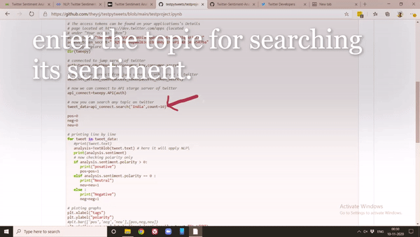

# testpytweets
Open test project in jupyter to run apllication

To install tweepy (using command,pip install tweepy)

SCREENSHOTS

ML MODEL FOR twiter SENTIMENT   ANALYSIS  OF TWEETS ON SPECIFIC KEYWORD IN REAL TIME THROUGH TWITTER sentiment analysis API

